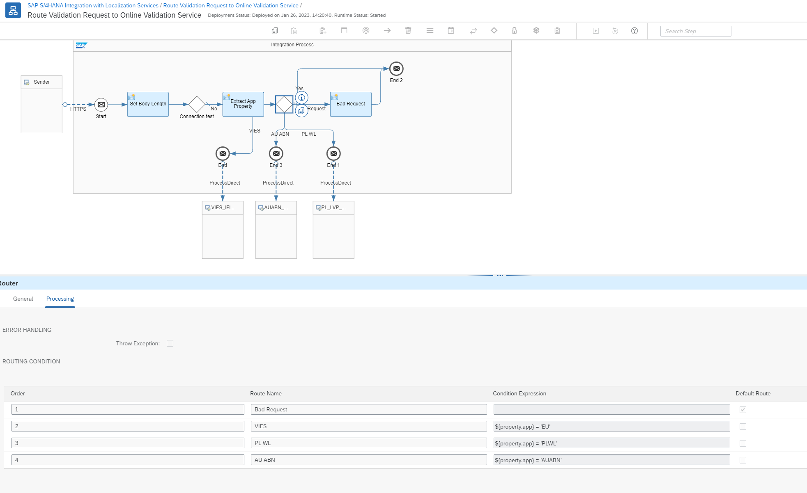

# Integration Flows

SAP recommneds using the [Cloud Platform integration](https://help.sap.com/docs/CLOUD_INTEGRATION?version=Cloud)(CPI) to consume an external API in an S/4 Hana system. The validations delivered by SAP use the [Integration Flows](https://help.sap.com/docs/CLOUD_INTEGRATION/368c481cd6954bdfa5d0435479fd4eaf/e5724cd84b854719973afe0356ea128b.html?version=Cloud)(iFlow) which can be deployed into your iFlow tenant and extended for your own validations. The necessary documentation for the iFlows used in SAP-delivered validations can be found here: [SAP S/4HANA Integration with Localization Services](https://api.sap.com/package/VATNumberValidation/documents).

## Router iFlow
The entry point to the localization package is the Route Validation Request to Online Validation Service iFlow. It receives the requests from an S/4 Hana system and forwads it to a validation-specific iFlow. The Router uses the name of the incoming xml element and its attribute to determine the subordinate iFlow to handle request. It can consume only requests with an XML payload having the following root element
`<VATValReq app='XXXXX'>`
where XXXX is the Check ID of your validation. 

## Develop your iFlow 
Deploy the SAP S/4HANA Integration with Localization Services package into your tenant and add your iFlow according to the [Developing Integration Content with SAP Cloud Integration](https://help.sap.com/docs/CLOUD_INTEGRATION/368c481cd6954bdfa5d0435479fd4eaf/e6b43b4c5a5042fda30a9dfdab97eff3.html?version=Cloud) guide. 
Then you can connect your iFlow to the Router by adding a new route as shown on the picture

The rest of the xml schema doesn't have any restrictions. The SAP-delivered implementation use the following root element for the response. It's using is not mandatory but recommended. 
`<VATValResp app="XXXXX">`

The router will route the request from the S/4 Hana sytem to the new iFlow and back without any modification.

# Serializers and Deserializers on the S/4 Hana side
If you decide to use the mentioned Router iFlow, the only requirement is using the xml format and the name of the root element and the `app` atribute. The iFlows shall handle the translation to and from the public API format. 